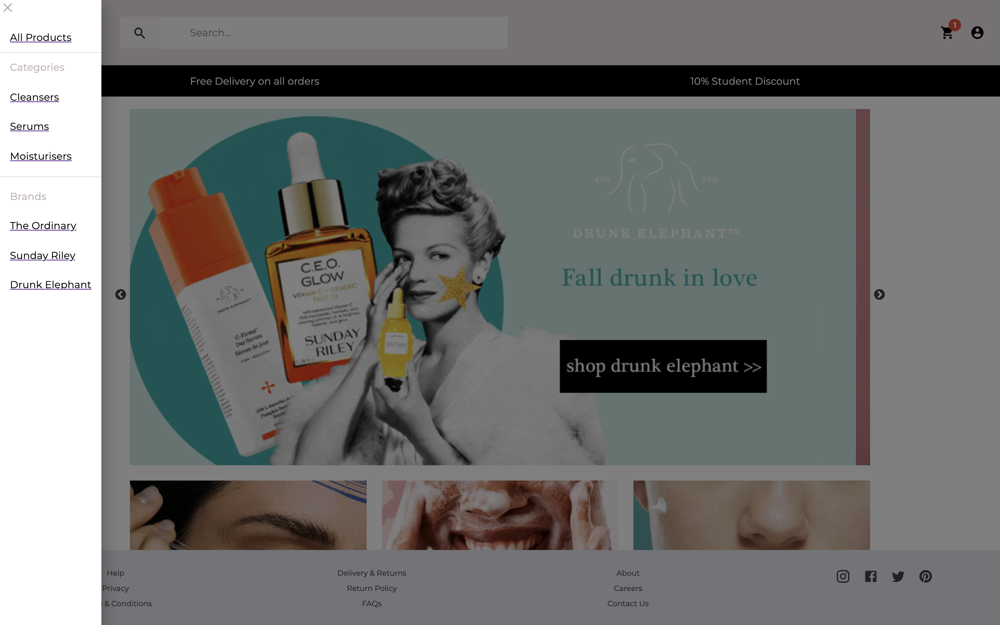
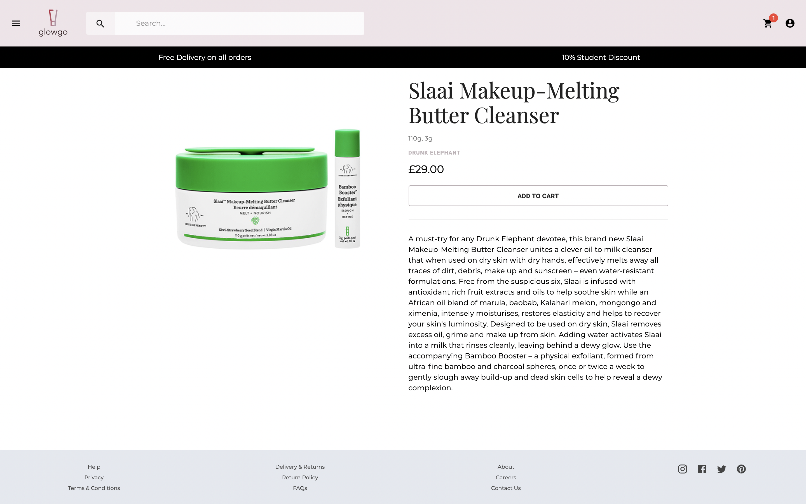

 

# Glowgo - MERN Ecommerce Store

## Description
Glowgo is a MERN application built with React, Node, Express and Mongoose. It's a simple one-stop-shop eCommerce store that allows beauty lovers to shop their favourite brands. 

The application allows users to browse the shop and register / sign in to proceed to checkout, and visit the protected order history route.

Glowgo was developed by myself as my final project on the University of Birmingham Coding Bootcampt to demonstrate a fully functioning React application with server-side CRUD funtionality and user authentication.

The application allows the user to
* Select products by brand or category
* Search by product name
* Login and checkout (dummy payment checkout)
* View their order history 

### User Story

> As a **beauty fan**, I want to **shop popular and emerging brands online, in a single place, that are accessible and delivered fast** so that **i can feel more confident in my skin and stay on top of trends**.

## Table of Contents
- [Preview](#Preview)
- [Future-Development](#Future-Development)
- [Contributing](#Contributing)
- [License](#License)
- [Environment](#Environment)

## Preview

> Visit the deployed application on [Heroku](https://glowgo.herokuapp.com/).

#### Mobile Responsive Design

#### Homepage

#### Product Search Page

#### Product Detail Page

#### Cart

#### Checkout

#### Order History

## Future-Development

* Enhanced search engine functionality utilising MongoDB Atlas Search
* Implement a sort by feature
* Create and update user address book
* Leave user reviews
* Integrate Stripe payment gateway
* Admin product management

## Contributing
Contributions are welcomed.

## License
MIT

## Environment
* React.js
* Mongoose and MongoDB Atlas
* Express.js
* Node.js
* React Material UI
* Joi validation
* Framer Motion
* Slick slide
* Cloudenary
* Postman
* Jason Web Token
* React Toastify
* Git
* GitHub
* Heroku
